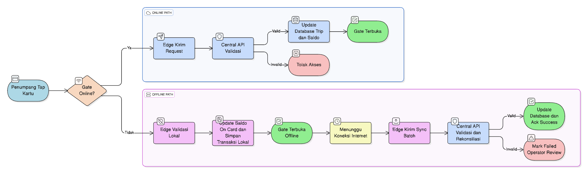
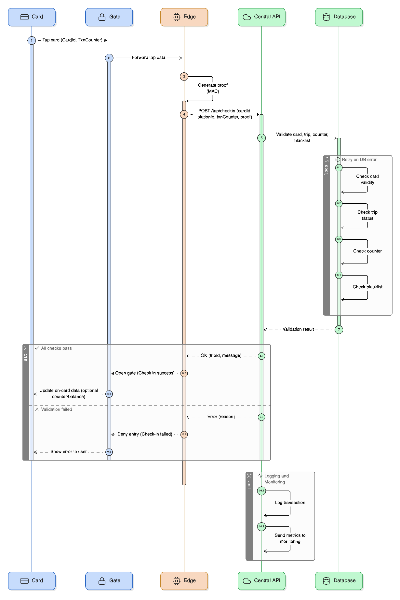
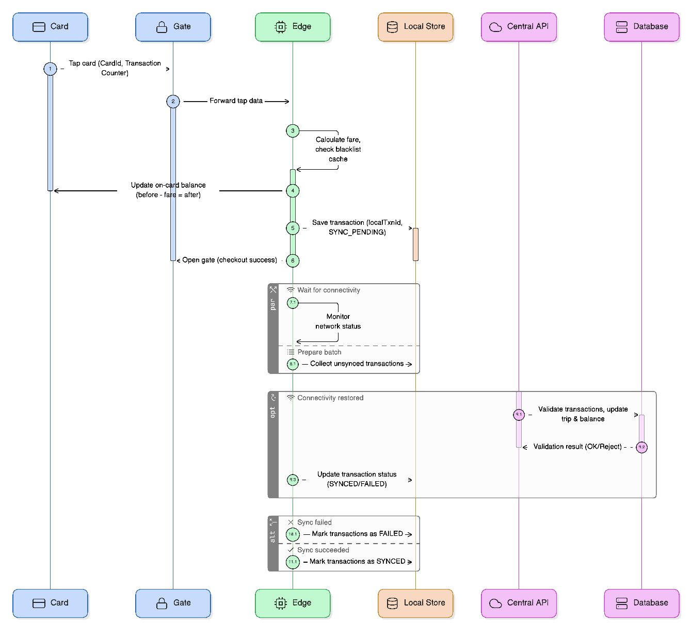

# 🚇 E-Ticketing System

Sistem ini adalah simulasi **E-Ticketing Transportasi Publik** yang mendukung:
- **Check-in / Check-out** kartu pada gate.
- **Sinkronisasi offline** saat device tidak terkoneksi internet.
- **Validasi trip dan saldo** secara real-time (online) maupun batch (offline).
- **Konfigurasi device & manajemen tarif**.

---

## 📂 Struktur Database

### Tabel Utama
- **users** → menyimpan akun admin/operator.
- **stations** → daftar stasiun.
- **devices** → gate device pada stasiun.
- **cards** → kartu penumpang (saldo, status, counter).
- **fares** → tarif perjalanan antar stasiun.
- **trips** → perjalanan kartu (entry-exit).
- **transactions** → detail transaksi kartu di gate.
- **sync_logs** → log sinkronisasi transaksi offline.

### Contoh Data Dummy

#### users
| id | username | role | fullname |
|----|----------|------|----------|
| 1 | admin | admin | Administrator |
| 2 | gateop1 | operator | Gate Operator 1 |

#### stations
| id | station_id | name |
|----|------------|------|
| 1 | ST01 | Stasiun A |
| 2 | ST02 | Stasiun B |
| 3 | ST03 | Stasiun C |

#### cards
| card_id | balance | status | txn_counter |
|---------|---------|--------|-------------|
| CARD101 | 20000   | ACTIVE | 1000 |
| CARD102 | 15000   | ACTIVE | 2000 |

#### fares
| from | to | amount |
|------|----|--------|
| ST01 | ST02 | 3000 |
| ST01 | ST03 | 6000 |
---

## 📊 Flowchart

### Penjelasan:
1. Penumpang tap kartu di gate.
2. Gate cek apakah **online**:
   - ✅ **Online** → request dikirim ke **Central API** → validasi saldo, blacklist, trip → database update → gate terbuka / tolak akses.
   - ❌ **Offline** → validasi lokal + update saldo on-card → gate terbuka → transaksi disimpan lokal → tunggu internet → batch sync ke server.

---

## 🧩 Sequence Diagram

### 1. Online Check-in

**Alur:**
1. Kartu ditap di gate.
2. Edge device kirim request ke Central API (`/tap/checkin`).
3. API validasi kartu, trip, counter, blacklist.
4. Jika valid → gate terbuka, trip tersimpan, saldo terupdate.  
   Jika invalid → akses ditolak.

---

### 2. Offline Checkout + Sync

**Alur:**
1. Kartu ditap saat gate offline.
2. Edge device hitung tarif lokal, update saldo on-card, simpan transaksi `SYNC_PENDING`.
3. Gate terbuka.
4. Setelah koneksi internet kembali → transaksi batch dikirim (`/sync/batch`).
5. Central API validasi & update trip + saldo.
6. Transaksi diberi status `SYNCED` atau `FAILED`.

---

## ⚙️ API Endpoint (Swagger)

- `POST /login` → login user (JWT).
- `POST /stations` → tambah stasiun.
- `POST /tap/checkin` → proses check-in.
- `POST /tap/checkout` → proses check-out.
- `POST /sync/batch` → upload log offline.
- `GET /config/{deviceId}` → ambil konfigurasi device.

---

## 📝 Ringkasan
- **Online mode** → transaksi langsung divalidasi di server.
- **Offline mode** → transaksi disimpan lokal, lalu disinkronisasi saat online.
- **Proteksi**: `txn_counter` mencegah replay/duplikasi transaksi.
- **Rekonsiliasi** memastikan saldo & trip konsisten antara kartu, device, dan server.
